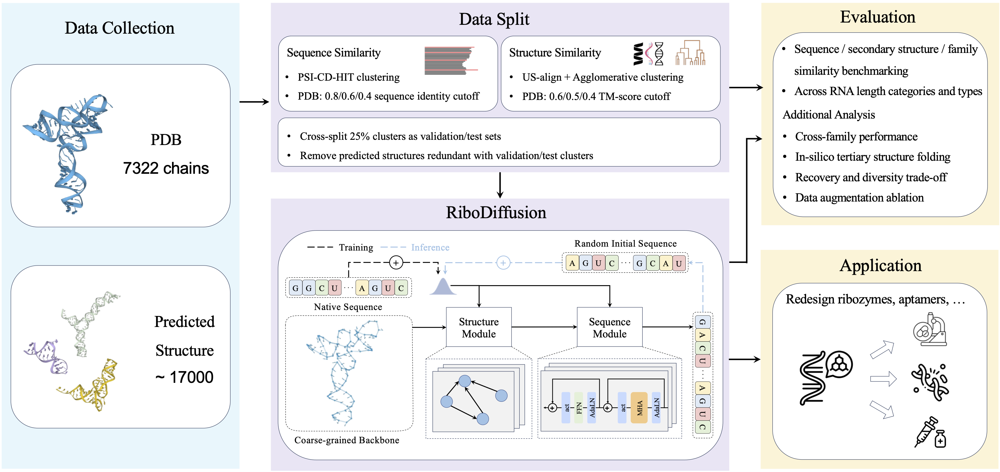

# RiboDiffusion

Tertiary Structure-based RNA Inverse Folding with Generative Diffusion Models

[](https://github.com/ml4bio/RiboDiffusion/blob/main/LICENSE)
[](https://arxiv.org/abs/2404.11199)



## Installation

Please refer to `requirements.txt` for the required packages.

Model checkpoint can be downloaded from [here](https://drive.google.com/drive/folders/10BNyCNjxGDJ4rEze9yPGPDXa73iu1skx?usp=drive_link).
Another checkpoint trained on the full dataset (with extra 0.1 Gaussian noise for coordinates) can be downloaded from [here](https://drive.google.com/file/d/1-IfWkLa5asu4SeeZAQ09oWm4KlpBMPmq/view?usp=sharing).

Download and put the checkpoint files in the `ckpts` folder.

## Usage

Inference demo notebook to get started: <a target="_blank" href="https://colab.research.google.com/drive/199D6B0FsIYf-gW-hfMEBCcKaai_hM_cU">
</a>.

Run the following command to run the example for one sequence generation:
```bash
CUDA_VISIBLE_DEVICES=0 python main.py --PDB_file example/R1107.pdb
```
The generated sequence will be saved in `exp_inf/fasta/R1107_0.fasta`.

Multiple sequence generation can be run by:
```bash
CUDA_VISIBLE_DEVICES=0 python main.py --PDB_file example/R1107.pdb --config.eval.n_samples 10
```

Adjusting the conditional scaling weight can be done by:
```bash
CUDA_VISIBLE_DEVICES=0 python main.py --PDB_file example/R1107.pdb --config.eval.n_samples 10 --config.eval.dynamic_threshold --config.eval.cond_scale 0.4
```

## Citation

If you find this work useful, please cite:

```
@article{10.1093/bioinformatics/btae259,
    author = {Huang, Han and Lin, Ziqian and He, Dongchen and Hong, Liang and Li, Yu},
    title = {RiboDiffusion: tertiary structure-based RNA inverse folding with generative diffusion models},
    journal = {Bioinformatics},
    volume = {40},
    number = {Supplement_1},
    pages = {i347-i356},
    year = {2024},
    month = {06},
    issn = {1367-4811}
}
```

## License
This project is licensed under the [MIT License](LICENSE).