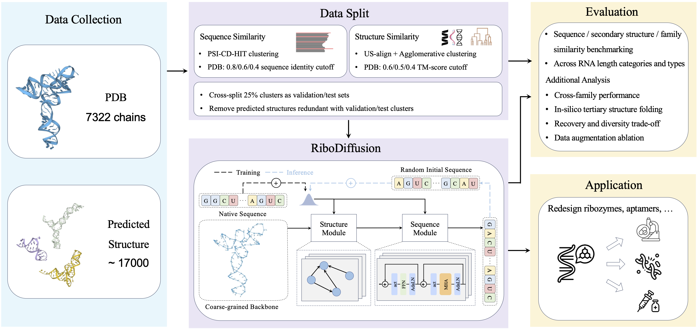

# RiboDiffusion

Tertiary Structure-based RNA Inverse Folding with Generative Diffusion Models

[](https://github.com/ml4bio/RiboDiffusion/blob/main/LICENSE)
[](https://arxiv.org/abs/2404.11199)



## Installation

Please refer to `requirements.txt` for the required packages.

Model checkpoint can be downloaded from [here](https://drive.google.com/drive/folders/10BNyCNjxGDJ4rEze9yPGPDXa73iu1skx?usp=drive_link).
Another checkpoint trained on the full dataset (with extra 0.1 Gaussian noise for coordinates) can be downloaded from [here](https://drive.google.com/file/d/1-IfWkLa5asu4SeeZAQ09oWm4KlpBMPmq/view?usp=sharing).

Download and put the checkpoint files in the `ckpts` folder.

## Usage

Inference demo notebook to get started: <a target="_blank" href="https://colab.research.google.com/drive/199D6B0FsIYf-gW-hfMEBCcKaai_hM_cU">
</a>.

Run the following command to run the example for one sequence generation:
```bash
CUDA_VISIBLE_DEVICES=0 python main.py --PDB_file example/R1107.pdb
```
The generated sequence will be saved in `exp_inf/fasta/R1107_0.fasta`.

Multiple sequence generation can be run by:
```bash
CUDA_VISIBLE_DEVICES=0 python main.py --PDB_file example/R1107.pdb --config.eval.n_samples 10
```

For more sequence diversity, you can use `exp_inf_large.pth` or adjust the conditional scaling weight by `--config.eval.cond_scale`.

An example for adjusting the conditional scaling weight is as follows:
```bash
CUDA_VISIBLE_DEVICES=0 python main.py --PDB_file example/R1107.pdb --config.eval.n_samples 10 --config.eval.dynamic_threshold --config.eval.cond_scale 0.4
```

## Training GVPTransCond Model

This section outlines how to train the GVPTransCond model for RNA inverse folding.

### Overview
A training script, `train.py`, is available to train the GVPTransCond model from scratch or fine-tune existing checkpoints.

### Configuration
Training behavior is primarily controlled by the configuration file: `configs/train_ribodiffusion.py`.

Key parameters you might want to adjust in this file include:
-   `config.train.dataset_path`: Path to the directory containing training PDB files.
-   `config.train.validation_dataset_path`: Path to the directory containing validation PDB files.
-   `config.train.epochs`: Total number of training epochs.
-   `config.train.batch_size`: Batch size for training and validation.
-   `config.train.checkpoint_dir`: Directory where checkpoints will be saved.
-   `config.optim.lr`: Learning rate for the optimizer.
-   `config.model`: Various model architecture parameters (e.g., hidden dimensions, number of layers) if you wish to experiment with the model structure.
-   `config.device`: Set to `cuda` or `cpu`.

### Data Preparation
The training script uses `datasets.pdb_dataset.PDBDataset`, which expects a list of PDB files for training and validation.

1.  Organize your PDB files into directories. For example:
    *   `./data/train/` (for training PDBs)
    *   `./data/val/` (for validation PDBs)
2.  Update the `config.train.dataset_path` and `config.train.validation_dataset_path` in `configs/train_ribodiffusion.py` to point to these directories.
    The script will automatically scan these directories for `.pdb` files.
    An example PDB file is provided at `example/R1107.pdb`.

### Running Training
To start the training process, run the `train.py` script from the root of the project:
```bash
python train.py
```
Currently, `train.py` loads its configuration directly from `configs/train_ribodiffusion.py`. If you need to override specific configuration values without editing the file, you would need to modify `train.py` to accept command-line arguments for those specific parameters.

### Checkpoints
During training, checkpoints (including the model state, optimizer state, and EMA model state) will be saved periodically.
By default, these are saved in the `./checkpoints/ribodiffusion/` directory, but this can be configured via `config.train.checkpoint_dir` in the training configuration file.

### Unit Tests
Basic unit tests for the training pipeline, including data loading, model forward pass, and a single training step, are available in `tests/test_training.py`.

To run these tests, use the standard Python unittest discovery mechanism from the project's root directory:
```bash
python -m unittest discover -s tests
```

## Citation

If you find this work useful, please cite:

```
@article{10.1093/bioinformatics/btae259,
    author = {Huang, Han and Lin, Ziqian and He, Dongchen and Hong, Liang and Li, Yu},
    title = {RiboDiffusion: tertiary structure-based RNA inverse folding with generative diffusion models},
    journal = {Bioinformatics},
    volume = {40},
    number = {Supplement_1},
    pages = {i347-i356},
    year = {2024},
    month = {06},
    issn = {1367-4811}
}
```

## License
This project is licensed under the [MIT License](LICENSE).